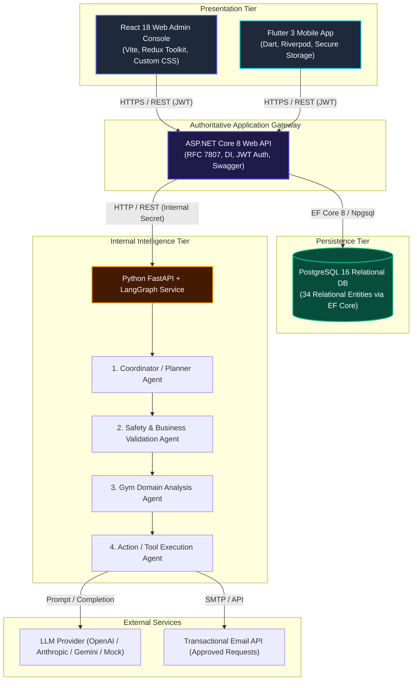

# SmartGym System Architecture & Component Topology

## 1. High-Level Architectural Diagram

## 2. Mandatory Architectural Constraints
1. **No Direct Database Access**: Neither React nor Flutter may establish direct TCP/SQL connections to PostgreSQL.
2. **No Direct AI Microservice Access**: The Python LangGraph AI microservice is strictly an internal service; public clients must route via ASP.NET Core controllers.
3. **No Direct Third-Party Access**: Supplier emails and order requests must be dispatched through server-side integrations managed by ASP.NET Core and the Action Agent.
4. **Stateful Human-in-the-Loop Gate**: Any repair recommendation exceeding **Rs. 25,000** must pause execution, persist state in PostgreSQL, and require an explicit authorization event from an Admin user in React before dispatching supplier orders.
