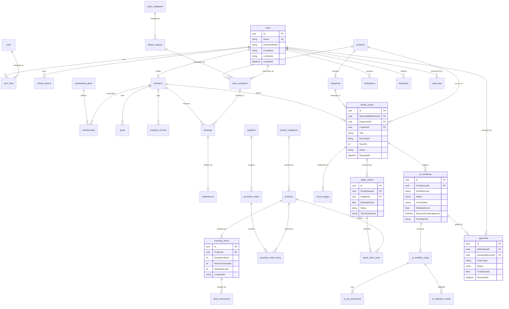

# SmartGym Relational Entity-Relationship (ER) Model

**Target Database**: PostgreSQL 16 (Relational Engine)  
**ORM Framework**: Entity Framework Core 8 (Npgsql Provider)  
**Total Relational Tables**: 36 tables  
**Integrity**: Full ACID compliance with foreign key constraints and cascade delete/restrict rules.

---

## 1. Complete System Entity-Relationship Diagram

---

## 2. Table-by-Table Architectural Schema

### 2.1 Identity & Access Control
1. **`users`**: Central account identity store containing credentials and timestamps.
   - Primary Key: `Id` (UUID)
   - Unique Index: `Email` (Case-insensitive unique)
2. **`roles`**: System permission tiers (`Admin`, `Manager`, `Trainer`, `Member`).
   - Primary Key: `Id` (UUID)
   - Unique Index: `Name`
3. **`user_roles`**: Many-to-Many junction between `users` and `roles`.
   - Composite PK: `(UserId, RoleId)`
   - Foreign Keys: `FK_user_roles_users_UserId`, `FK_user_roles_roles_RoleId` (Cascade Delete)
4. **`refresh_tokens`**: Revocable JWT session tokens.
   - Primary Key: `Id` (UUID)
   - Foreign Key: `FK_refresh_tokens_users_UserId` (Cascade Delete)
   - Columns: `Token`, `ExpiresAt`, `RevokedAt`, `ReplacedByToken`

### 2.2 Facility Maintenance & Multi-Agent AI Subsystem
5. **`facility_issues`**: Primary equipment problem registry.
   - Primary Key: `Id` (UUID)
   - Foreign Keys:
     - `FK_facility_issues_members_ReportedByMemberId` (Restrict Delete)
     - `FK_facility_issues_equipment_EquipmentId` (Set Null)
     - `FK_facility_issues_locations_LocationId` (Set Null)
   - Columns: `Title`, `Description`, `Severity`, `Status`, `ReportedAt`, `ResolvedAt`, `SanitizedDescription`, `ModerationStatus`
6. **`issue_images`**: Evidence photographs uploaded by members.
   - Primary Key: `Id` (UUID)
   - Foreign Key: `FK_issue_images_facility_issues_FacilityIssueId` (Cascade Delete)
7. **`ai_workflows`**: State persistence for LangGraph multi-agent execution runs.
   - Primary Key: `Id` (UUID)
   - Foreign Key: `FK_ai_workflows_facility_issues_FacilityIssueId` (Cascade Delete)
   - Columns: `WorkflowType`, `Status`, `CurrentStep`, `EstimatedCost`, `RequiresHumanApproval`, `CorrelationId`
8. **`ai_workflow_steps`**: Chronological record of agent invocations (`Safety`, `Planner`, `Domain`, `Action`).
   - Primary Key: `Id` (UUID)
   - Foreign Key: `FK_ai_workflow_steps_ai_workflows_AIWorkflowId` (Cascade Delete)
9. **`ai_tool_executions`**: Auditable record of every tool executed by AI agents.
   - Primary Key: `Id` (UUID)
   - Foreign Key: `FK_ai_tool_executions_ai_workflow_steps_AIWorkflowStepId` (Cascade Delete)
   - Columns: `ToolName`, `InputParametersJson`, `OutputResultJson`, `ExecutionTimeMs`, `IsSuccess`
10. **`ai_validation_results`**: Deterministic rule outcomes from `SafetyValidationAgent`.
    - Primary Key: `Id` (UUID)
    - Foreign Key: `FK_ai_validation_results_ai_workflow_steps_AIWorkflowStepId` (Cascade Delete)
11. **`approvals`**: Human-in-the-Loop decision records.
    - Primary Key: `Id` (UUID)
    - Foreign Keys:
      - `FK_approvals_ai_workflows_AIWorkflowId` (Cascade Delete)
      - `FK_approvals_users_ReviewedByUserId` (Restrict Delete)
    - Columns: `ActionType`, `Status`, `CostEstimate`, `DecisionNotes`, `ReviewedAt`

### 2.3 Inventory, Supplements & Suppliers
12. **`product_categories`**: Hierarchical supplement categories (Proteins, Creatines, Vitamins).
13. **`products`**: Retail supplement items with SKU, brand, and retail price.
14. **`inventory_items`**: Stock physical tracking records (`QuantityInStock`, `ReorderThreshold`, `LocationBin`).
15. **`stock_movements`**: Immutable audit logs of every addition, deduction, or adjustment.
16. **`suppliers`**: Certified parts and supplement vendor directory.
17. **`purchase_orders`**: Procurement orders placed with suppliers.
18. **`purchase_order_items`**: Itemized breakdown of supplier orders.

### 2.4 Fitness Operations & Bookings
19. **`locations`**: Physical gym rooms and functional workout zones.
20. **`equipment`**: Catalog of gym machines, serial numbers, and maintenance histories.
21. **`class_categories`**: Fitness genres (Cardio, HIIT, Strength, Yoga).
22. **`fitness_classes`**: Reusable class definitions and max capacities.
23. **`class_schedules`**: Concrete timetable slots with date, start/end time, and assigned trainer.
24. **`bookings`**: Member reservations with capacity guardrails.
25. **`attendances`**: Verified trainer check-in records.

### 2.5 Memberships, Goals & Communications
26. **`members`**: Member profiles linked 1-to-1 with `users`.
27. **`membership_plans`**: Subscription definitions (Bronze, Silver, Gold, Platinum).
28. **`memberships`**: Active subscription contracts with start and expiry dates.
29. **`goals`**: Member fitness targets (Weight, Body Fat %, Muscle Mass).
30. **`progress_records`**: Chronological milestone measurement logs.
31. **`feedbacks`**: Member suggestions and ratings with manager moderation notes.
32. **`notifications`**: Targeted user alerts across Web and Mobile.
33. **`audit_logs`**: System-wide administrative action logs with IP address and timestamps.
34. **`repair_orders`**: Operational maintenance dispatch orders.
35. **`repair_order_items`**: Itemized parts required for equipment repair.
36. **`__EFMigrationsHistory`**: Entity Framework migration tracking table.
