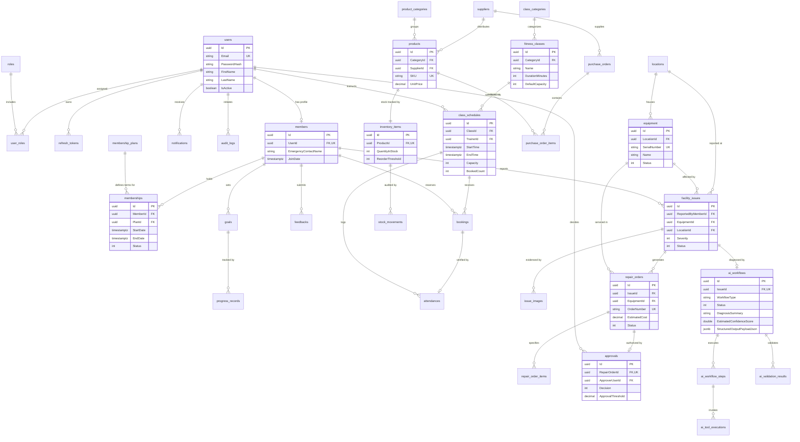

# SmartGym Entity-Relationship & Relational Architecture Specification

## 1. Entity-Relationship Diagram (ERD)

---

## 2. Cardinality & Relationship Catalog

### 2.1 One-to-One Relationships (1:1)

| Parent Entity | Child Entity | Foreign Key Column | Constraints / Rules |
| :--- | :--- | :--- | :--- |
| `users` | `members` | `members.UserId` | Unique Index, Cascade Delete. Each user account has at most one member profile. |
| `products` | `inventory_items` | `inventory_items.ProductId` | Unique Index, Cascade Delete. Every sellable product has exactly one inventory stock record. |
| `bookings` | `attendances` | `attendances.BookingId` | Unique Index, Cascade Delete. A class booking can have at most one verified attendance record. |
| `facility_issues` | `ai_workflows` | `ai_workflows.IssueId` | Unique Index, Cascade Delete. Each reported issue triggers exactly one autonomous diagnostic workflow. |
| `repair_orders` | `approvals` | `approvals.RepairOrderId` | Unique Index, Cascade Delete. A repair order has at most one human manager approval record. |

### 2.2 Many-to-Many Relationships (N:M)

| Left Entity | Right Entity | Join Table | Key Structure |
| :--- | :--- | :--- | :--- |
| `users` | `roles` | `user_roles` | Composite PK `(UserId, RoleId)`. Both foreign keys cascade on deletion. |

### 2.3 One-to-Many Relationships (1:N)

#### Identity Domain
- `users (1)` -> `refresh_tokens (N)`: Active sessions and authentication tokens per user. Cascade delete.
- `users (1)` -> `notifications (N)`: User alert inbox. Cascade delete.
- `users (1)` -> `class_schedules (N)`: Trainer assignments. Restrict delete (cannot delete active trainers with scheduled classes).
- `users (1)` -> `approvals (N)`: Manager approvals granted. Restrict delete (preserves governance audit trail).

#### Membership Domain
- `members (1)` -> `memberships (N)`: Subscription history over time. Cascade delete.
- `membership_plans (1)` -> `memberships (N)`: Memberships subscribed to plan. Restrict delete.
- `members (1)` -> `goals (N)`: Fitness goals. Cascade delete.
- `goals (1)` -> `progress_records (N)`: Numerical measurements over time. Cascade delete.
- `members (1)` -> `feedbacks (N)`: Feedback history. Restrict delete.

#### Classes Domain
- `class_categories (1)` -> `fitness_classes (N)`: Class taxonomy. Restrict delete.
- `fitness_classes (1)` -> `class_schedules (N)`: Timetable slots. Cascade delete.
- `class_schedules (1)` -> `bookings (N)`: Member reservations. Cascade delete.
- `members (1)` -> `bookings (N)`: Member booking history. Restrict delete.
- `class_schedules (1)` -> `attendances (N)`: Attendance records for session. Restrict delete.

#### Inventory Domain
- `suppliers (1)` -> `products (N)`: Product catalog per vendor. Restrict delete.
- `product_categories (1)` -> `products (N)`: Product categorization. Restrict delete.
- `inventory_items (1)` -> `stock_movements (N)`: Stock audit history. Cascade delete.
- `suppliers (1)` -> `purchase_orders (N)`: Procurement orders. Restrict delete.
- `purchase_orders (1)` -> `purchase_order_items (N)`: Order line items. Cascade delete.
- `products (1)` -> `purchase_order_items (N)`: Product procurement lines. Restrict delete.

#### Facility & Maintenance Domain
- `locations (1)` -> `equipment (N)`: Equipment installed per room. Restrict delete.
- `locations (1)` -> `facility_issues (N)`: Incidents reported per location. Restrict delete.
- `equipment (1)` -> `facility_issues (N)`: Maintenance incidents per machine. Restrict delete.
- `facility_issues (1)` -> `issue_images (N)`: Evidence photos. Cascade delete.
- `facility_issues (1)` -> `repair_orders (N)`: Repair orders raised for incident. Restrict delete.
- `equipment (1)` -> `repair_orders (N)`: Repair orders for asset. Restrict delete.
- `repair_orders (1)` -> `repair_order_items (N)`: Parts and replacement items. Cascade delete.

#### Agentic AI Domain
- `ai_workflows (1)` -> `ai_workflow_steps (N)`: Sequenced execution steps. Cascade delete.
- `ai_workflow_steps (1)` -> `ai_tool_executions (N)`: Individual tool invocations per step. Cascade delete.
- `ai_workflows (1)` -> `ai_validation_results (N)`: Deterministic safety guardrail evaluations. Cascade delete.

---

## 3. Referential Integrity & Cascade Strategy

To ensure zero orphaned records while maintaining strict compliance with operational audit standards:

1. **Compositional Child Records (Cascade):**
   When a parent business entity is removed, strictly dependent child records are safely removed via database-level `ON DELETE CASCADE`:
   - `users` -> `refresh_tokens`, `user_roles`
   - `members` -> `memberships`, `goals`
   - `goals` -> `progress_records`
   - `fitness_classes` -> `class_schedules`
   - `class_schedules` -> `bookings`
   - `products` -> `inventory_items`
   - `inventory_items` -> `stock_movements`
   - `purchase_orders` -> `purchase_order_items`
   - `facility_issues` -> `issue_images`, `ai_workflows`
   - `repair_orders` -> `repair_order_items`, `approvals`
   - `ai_workflows` -> `ai_workflow_steps`, `ai_validation_results`
   - `ai_workflow_steps` -> `ai_tool_executions`

2. **Master & Transactional History (Restrict):**
   Deleting a master record is blocked (`ON DELETE RESTRICT`) if operational history exists:
   - Cannot delete a `supplier` if products or purchase orders exist.
   - Cannot delete an `equipment` asset if open facility issues or repair history exist.
   - Cannot delete a `member` who has pending bookings or active attendance logs.
   - Cannot delete a `user` who has recorded formal repair approvals.

3. **Audit Trail Decoupling (SetNull):**
   - In `audit_logs`, if a user account is deleted or anonymized under GDPR / privacy standards, `audit_logs.UserId` is set to `NULL` via `ON DELETE SET NULL`. The audit action, payload diff, and timestamp remain permanently intact.

---

## 4. Cross-Domain Transactional Boundaries

The database model is architected to guarantee atomic multi-table consistency via `ITransactionService`:

1. **Inventory Stock Adjustment (`ExecuteStockMovementAtomicAsync`):**
   - Locks the `inventory_items` row.
   - Evaluates `QuantityInStock + adjustment >= 0`.
   - Modifies `QuantityInStock`.
   - Inserts audit `stock_movements` record.
   - Writes immutable `audit_logs` record.
   - Atomic commit or complete rollback.

2. **Class Booking Reservation (`ExecuteBookingAtomicAsync`):**
   - Verifies `class_schedules.Status == Scheduled`.
   - Checks `class_schedules.BookedCount < Capacity`.
   - Verifies member does not hold an active booking.
   - Atomically increments `BookedCount`.
   - Inserts `bookings` record.

3. **Repair & Human Approval (`ExecuteRepairApprovalAtomicAsync`):**
   - Verifies `repair_orders` has no prior decision.
   - Inserts `approvals` record with manager decision.
   - If `Approved`, transitions `repair_orders.Status = Approved` and sets `equipment.Status = UnderRepair`.
   - Logs governance event in `audit_logs`.

4. **Agentic AI Approval Gating (`ExecuteAIApprovalAtomicAsync`):**
   - Reads `ai_workflows` record and verifies step awaiting human sign-off.
   - Sets `HumanApprovalGranted = true/false`.
   - Updates `facility_issues.Status = InRepair` if approved.
   - Logs decision in `audit_logs`.
