# SmartGym Architecture Diagrams Specification

This document presents the complete architectural diagram suite for SmartGym, modeled using GitHub-compatible Mermaid syntax.

---

## 1. Overall System Architecture
Shows the physical and logical boundaries of the 4-tier ecosystem.

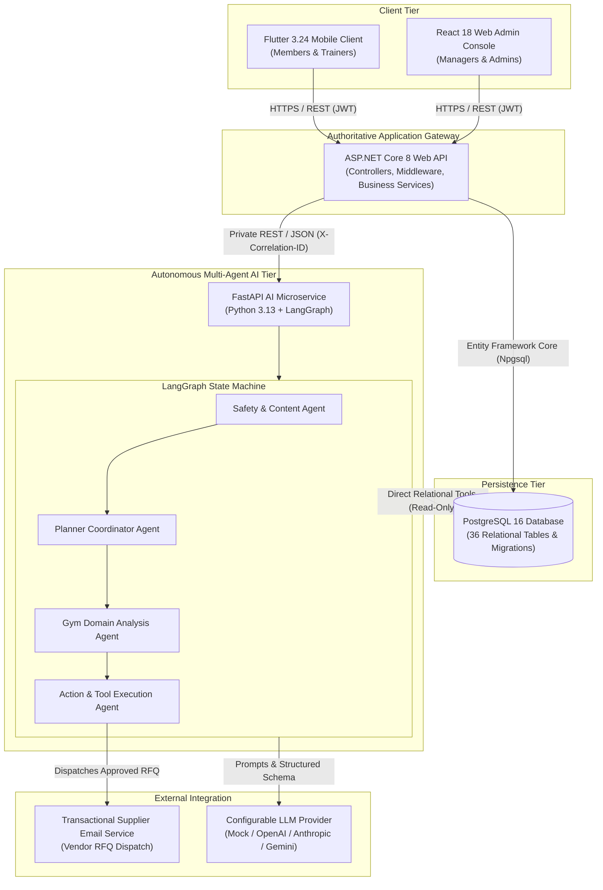

---

## 2. Database Architecture
Illustrates core data domains and relationships in PostgreSQL 16.

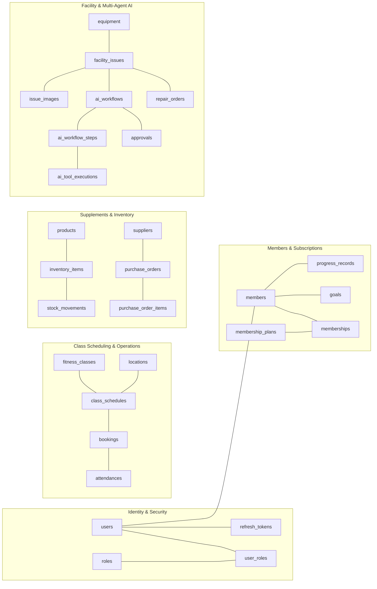

---

## 3. ASP.NET Core Layered Architecture
Depicts Clean Architecture separation of concerns within `SmartGym.Api`.

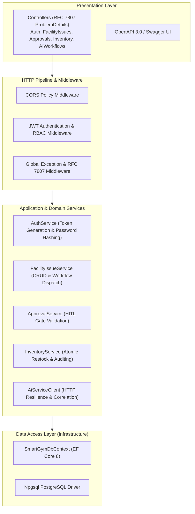

---

## 4. React Web Admin Architecture
Details component composition, Redux store slices, and protected routing.

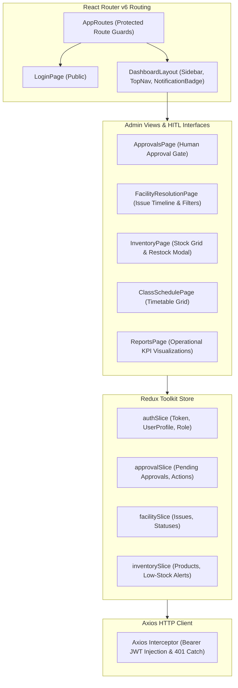

---

## 5. Flutter Mobile Architecture
Illustrates Riverpod state management, secure storage, and screen navigation.

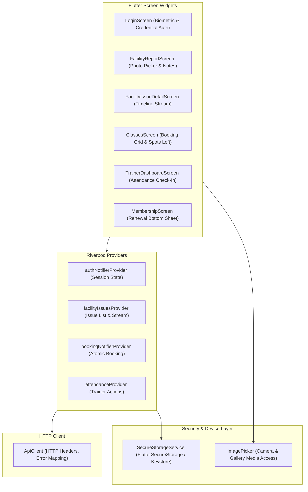

---

## 6. Agentic AI Multi-Agent Architecture
Demonstrates the 4 distinct specialized agents and their interaction with the LangGraph state machine.

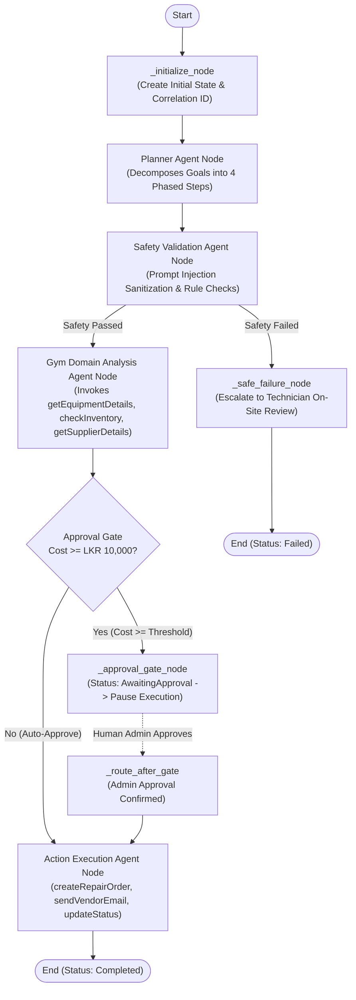

---

## 7. Production & Local Deployment Architecture
Shows Docker Compose containerization and port mapping.

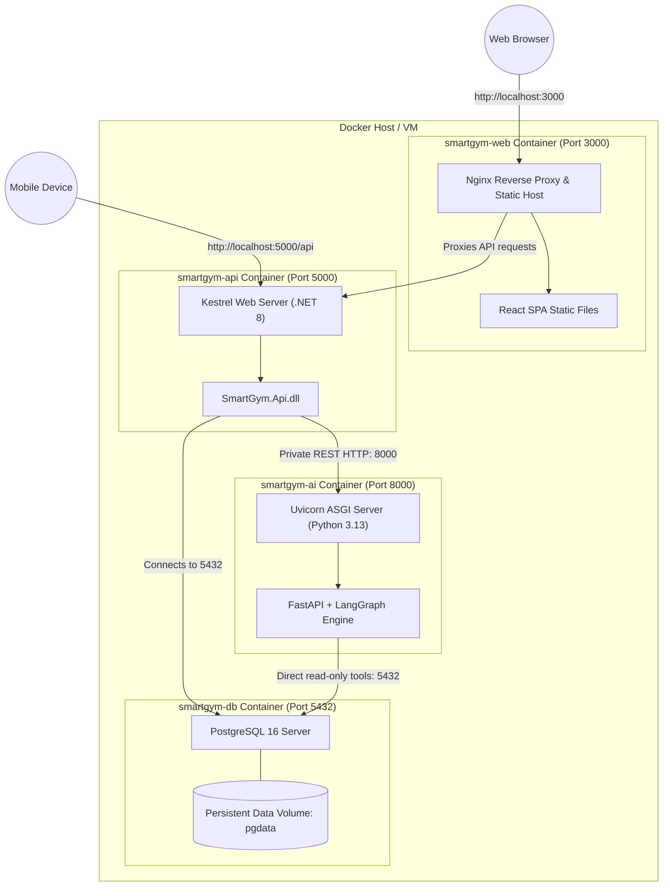

---

## 8. Authentication & Authorization Flow (JWT & RBAC)
Details the dual-token issuance, verification, and role validation.

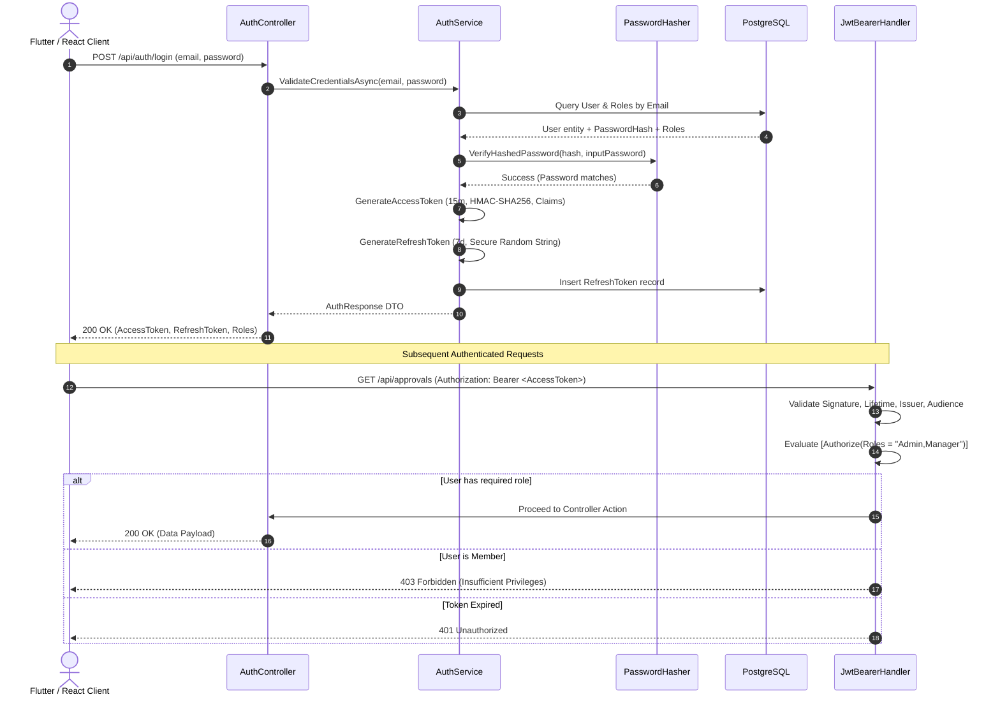

---

## 9. Main AI Maintenance Workflow
End-to-end trace from issue reporting to automated resolution.

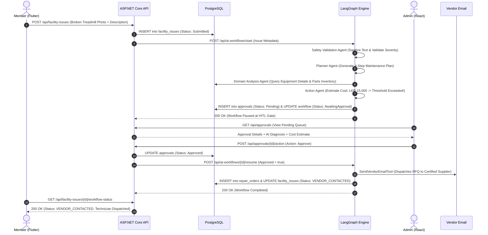

---

## 10. Human-in-the-Loop Approval Workflow
Detailed state machine of the financial approval gate.

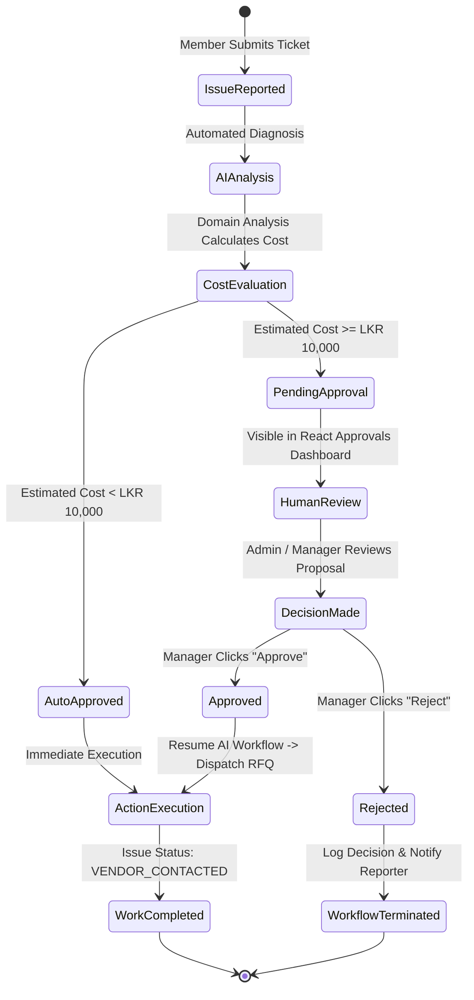

---

## 11. Third-Party Integration Workflow
Transactional email adapter execution with degraded mode resilience.

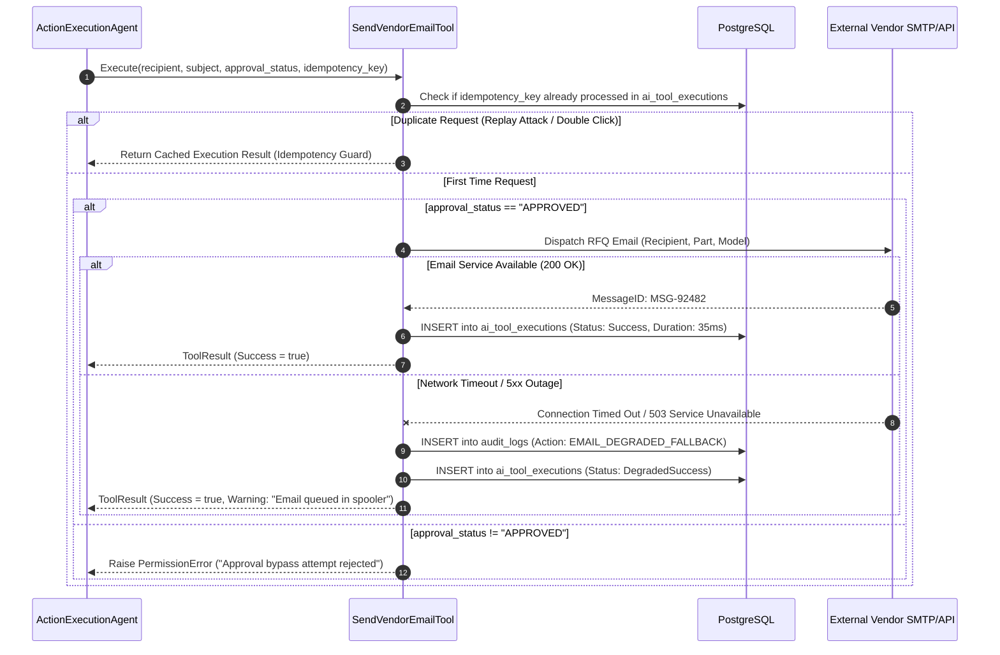

---

## 12. CI/CD GitHub Actions Pipeline
Visualizes the automated continuous integration workflow executed on push and pull requests.

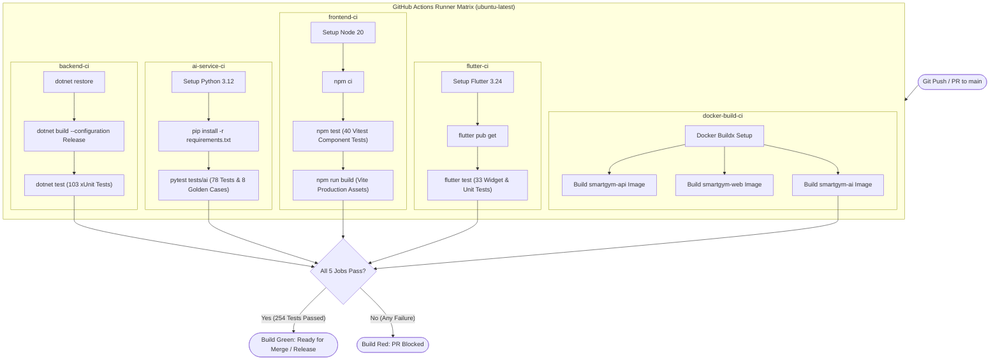
